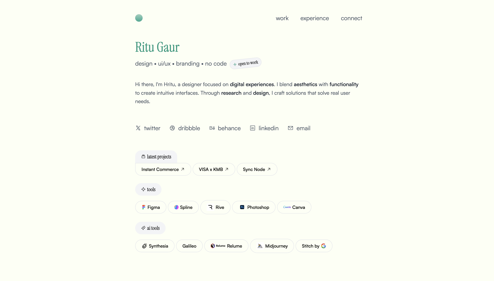

# Design Portfolio - Progressive Web App (PWA)

A modern, responsive, fully server-side rendered portfolio website built as a **Progressive Web App** with the powerful [T3 Stack](https://create.t3.gg/). This PWA portfolio showcases work, experience, and provides a seamless way for potential clients or employers to connect, with native app-like experience across all devices.



# Live Link: [https://design-portfolio-eight-gules.vercel.app/](https://design-portfolio-eight-gules.vercel.app/)

## 🌟 Features

- **Progressive Web App**: Installable on any device with native app-like experience
- **Modern Design**: Built with Next.js 15 and Tailwind CSS for a beautiful, responsive interface
- **Type Safety**: End-to-end type safety with TypeScript
- **Server-Side Rendering**: Fully server-side rendered for optimal performance and SEO
- **Offline Ready**: PWA capabilities for enhanced user experience
- **Cross-Platform**: Works seamlessly on desktop, mobile, and tablet devices
- **App-like Experience**: Native splash screens, icons, and standalone display mode
- **Contact Form**: Integrated email functionality using Gmail API
- **Dynamic Routes**:
  - `/`: Home page/Portfolio showcase
  - `/experience`: Professional experience and skills
  - `/connect`: Contact form and social links

## 📱 PWA Features

- **Installable**: Add to home screen on mobile devices and desktop
- **Standalone Mode**: Runs in full-screen mode without browser UI
- **Custom Icons**: Optimized icons for all device sizes and platforms
- **Splash Screens**: Native splash screens for iOS devices (iPhone 16 series support included)
- **Responsive**: Adapts to all screen sizes from mobile to desktop
- **Fast Loading**: Optimized for performance with SSR and modern web technologies

### 📲 Installation Instructions

**On Mobile (iOS/Android):**
1. Open the website in your browser
2. Tap the "Share" button (iOS) or menu button (Android)
3. Select "Add to Home Screen"
4. The app will be installed and accessible from your home screen

**On Desktop (Chrome/Edge):**
1. Visit the website
2. Look for the install icon in the address bar
3. Click "Install" to add the app to your desktop
4. Launch from your applications folder or desktop

## 🛠️ Tech Stack

- **Framework**: [Next.js 15](https://nextjs.org) - React framework for production with SSR
- **PWA**: Native Progressive Web App capabilities with manifest and optimized assets
- **Styling**: [Tailwind CSS](https://tailwindcss.com) - Utility-first CSS framework
- **Email**: Gmail API integration for contact form
- **Type Safety**: TypeScript for enhanced development experience
- **Code Quality**:
  - ESLint for code linting
  - Prettier for code formatting

## 🚀 Getting Started

1. Clone the repository
2. Install dependencies:
   ```bash
   npm install
   # or
   yarn install
   ```
3. Set up environment variables:
   - Copy `.env.example` to `.env.local`
   - Configure your Gmail credentials:
     - GMAIL_APP_ID: Your Gmail address
     - GMAIL_APP_PASSWORD: Your 16-character app password
     - EMAIL_TO: Destination email for contact form

4. Run the development server:
   ```bash
   npm run dev
   # or
   yarn dev
   ```

5. Open [http://localhost:3000](http://localhost:3000) in your browser

## 📧 Email Configuration

The contact form uses Gmail API for sending emails. To set it up:

1. Enable 2-factor authentication in your Google Account
2. Generate an app password:
   - Go to Security > 2-Step Verification > App passwords
   - Generate a new password for "Mail"
3. Use the generated 16-character password in your `.env.local`

## 🎨 PWA Assets

The project includes comprehensive PWA assets:

- **Manifest Icons**: Optimized icons for Android and web platforms
- **Apple Touch Icons**: iOS-specific icons for home screen installation
- **Apple Splash Screens**: Custom splash screens for all iPhone models (including iPhone 16 series)
- **Favicon**: Multi-size favicon support
- **Android Chrome Icons**: Optimized for Android Chrome installation

All assets are automatically configured and served through the Next.js manifest system.

## 📁 Project Structure

```
src/
├── app/                    # Next.js 15 app directory
│   ├── manifest.ts        # PWA manifest configuration
│   ├── layout.tsx         # Root layout with PWA metadata
│   └── ...
├── components/            # Reusable React components
├── constants/             # App configuration and constants
│   └── app-info.ts       # PWA metadata and splash screen config
├── emails/               # Email templates
└── styles/               # Global styles and Tailwind config
public/
├── manifest-icon-*.png   # PWA manifest icons
├── apple-icon-*.png      # iOS app icons
├── apple-splash-*.png    # iOS splash screens (38 variants)
├── android-chrome-*.png  # Android icons
└── favicon.*             # Favicon files
```

## 🌐 Browser Compatibility

This PWA is compatible with:

- **Chrome/Chromium**: Full PWA support including installation
- **Safari (iOS/macOS)**: Native iOS app experience with splash screens
- **Firefox**: Basic PWA functionality
- **Edge**: Full PWA support including installation
- **Samsung Internet**: Full PWA support on Android

## ⚡ Performance Features

- **Server-Side Rendering**: Fast initial page loads
- **Optimized Images**: WebP format with fallbacks
- **Code Splitting**: Automatic code splitting with Next.js
- **Caching**: Optimized caching strategies for static assets
- **Lighthouse Score**: Optimized for high performance, accessibility, and SEO scores

## 🚀 Deployment

The PWA is optimized for deployment on:

- **Vercel** (recommended): Automatic PWA optimization
- **Netlify**: Full PWA support with proper headers
- **Any static hosting**: Works with any hosting that supports HTTPS

### PWA Requirements for Production:
- ✅ HTTPS (required for PWA features)
- ✅ Valid manifest.json
- ✅ Service worker (handled by Next.js)
- ✅ Responsive design
- ✅ Fast loading times

## 📱 Testing PWA Features

To test PWA functionality locally:

1. Build the production version:
   ```bash
   npm run build
   npm run start
   ```

2. Open Chrome DevTools > Application tab
3. Check "Manifest" and "Service Workers" sections
4. Use "Add to homescreen" option to test installation

## 🤝 Contributing

1. Fork the repository
2. Create a feature branch
3. Make your changes
4. Test PWA functionality
5. Submit a pull request

## 📄 License

This project is open source and available under the [MIT License](LICENSE).

---

**Built with ❤️ using the T3 Stack and PWA best practices**
